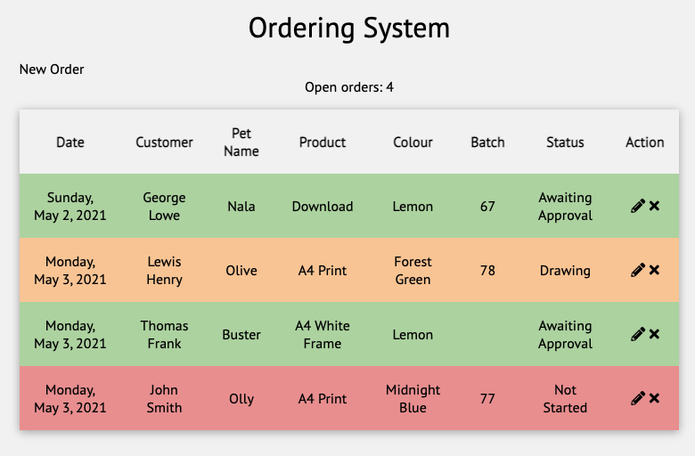
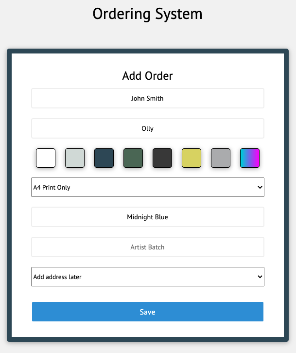
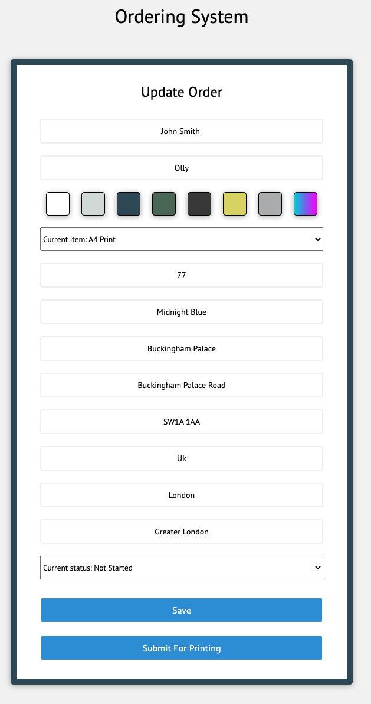
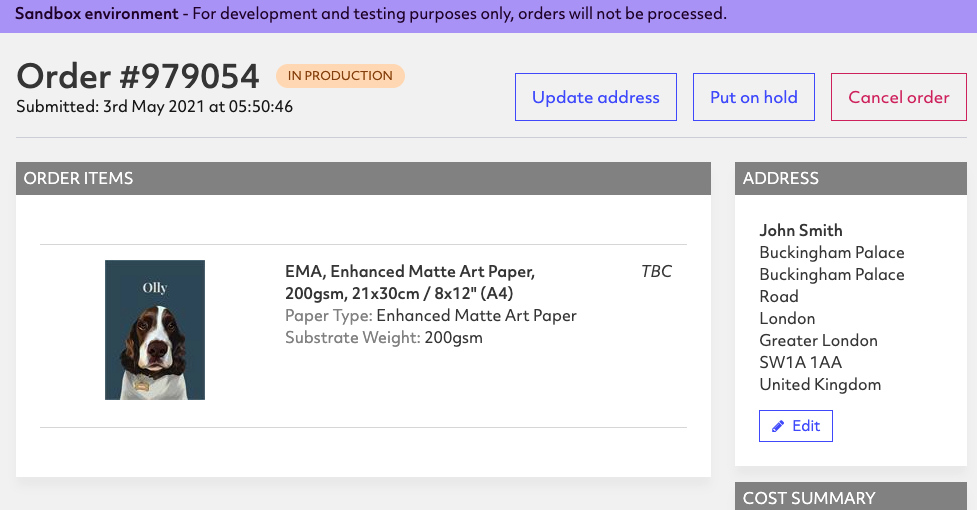

# Ordering System for Ecommerce Store 📦

A fullstack node.js management system for bespoke customer artwork orders made on my [Ecommerce store](https://www.etsy.com/uk/shop/thepawtraitdesignco). Orders are stored in a MongoDB database and their current status and information can be updated.

Orders handled by this system are physical prints. Once the artwork is ready, the order is sent via a POST request to an external [API provided by a printing company](https://www.pwinty.com/api/)

Stack used: MongoDB, Express, JS, Node.js

## Key Features

- [x] Add new orders manually
- [x] View all current orders
- [x] Update order information
- [x] Submit basic order information to Pwinty API
- [ ] Submit artwork file alongside order information
- [ ] Contact customer on Etsy to let them know order has been shipped

## Screenshots

 

## Created by:

[George Lowe](https://github.com/georgelowe)

Contact me here:

  
  

